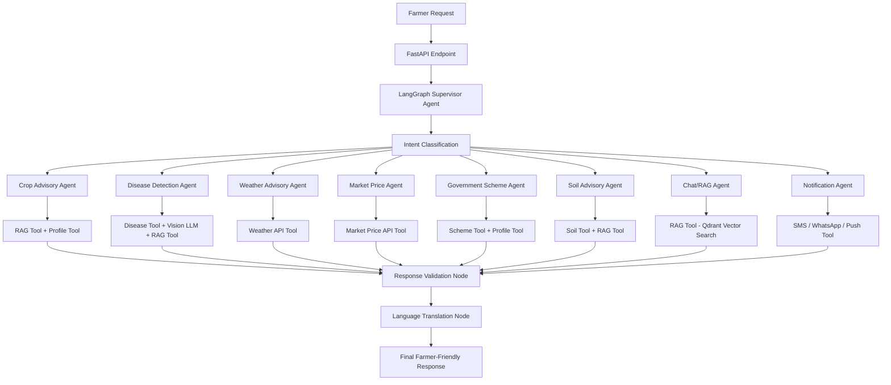

# AGRI AI PLATFORM — Architecture Document

---

## 1. Project Overview

### What is this platform?

The **Agri AI Platform** is a complete AI-powered farmer support system for Indian farmers. It goes beyond a simple chatbot to deliver a full-stack solution covering crop advisory, disease detection, weather alerts, market prices, government schemes, soil health, and multilingual support — all in one place.

At its core, the platform uses **LangGraph** to coordinate multiple specialized AI agents. Instead of routing every farmer query through a single generic LLM, LangGraph acts as an orchestrator — it classifies the farmer's intent and delegates the request to the correct expert agent (crop, disease, weather, market, scheme, soil, or chat). Each agent uses its own tools, RAG retrieval, and API calls to produce a targeted, accurate response.

### How is it different from LLM_Agri_Bot?

| Aspect | LLM_Agri_Bot (Reference) | Agri AI Platform (Target) |
|---|---|---|
| Framework | Flask | FastAPI |
| Purpose | Single-topic Q&A chatbot | Multi-module farmer support platform |
| Users | Anonymous sessions | Registered farmer profiles |
| AI Architecture | Single LLM + basic prompts | LangGraph multi-agent system |
| AI Intelligence | No RAG, no memory | RAG + vector DB + multi-model AI |
| Features | Chat, Voice, Image Q&A | 9+ specialized modules |
| Auth | None | JWT-based auth with roles |
| Database | Redis only | MongoDB + Redis + Qdrant |
| Deployment | Render (single container) | Docker + Nginx + Cloud-ready |
| Mobile | Not supported | API-first, mobile-ready |

### Goal

Solve real problems that Indian farmers face daily — not just answer questions. Each feature module targets a specific pain point: not knowing when to sow, not recognizing diseases early, missing government scheme deadlines, selling at wrong prices.

---

## 2. Existing Project Analysis

### Current LLM_Agri_Bot Structure

```
LLM_Agri_Bot/
├── app/
│   ├── __init__.py          # App factory (Flask)
│   ├── config.py            # Config via env vars
│   ├── routes/
│   │   ├── chat.py          # POST /chat, POST /chat/clear, GET /health
│   │   └── main.py          # GET / , robots.txt, sitemap.xml, llms.txt
│   ├── services/
│   │   ├── llm_service.py   # Groq SDK (text + vision models)
│   │   ├── memory_service.py# Redis conversation memory + in-memory fallback
│   │   ├── prompt_manager.py# XML system prompt + message builder
│   │   ├── stt_service.py   # Whisper STT (Groq / HuggingFace)
│   │   └── tts_service.py   # Orpheus TTS (Groq / gTTS)
│   ├── static/              # CSS, JS, favicon
│   └── templates/index.html # Single-page chat UI
├── run.py
├── gunicorn.conf.py
├── Dockerfile
└── requirements.txt
```

### Current Features

- Text chat with LLM (Groq: gpt-oss-120b)
- Voice input (Whisper STT)
- Voice output (Orpheus TTS)
- Image upload and agricultural image Q&A (Llama 4 Scout vision)
- Redis-backed conversation memory with in-memory fallback
- Multilingual response (language-follow mode)
- XML + CoT system prompt (Krishi Sahayak persona)

### Limitations

- No user registration or farmer profiles
- No RAG — LLM has no access to a curated knowledge base
- No disease detection pipeline (only basic image Q&A)
- No weather, market price, or government scheme integration
- No soil advisory module
- No admin dashboard or content management
- No persistent data — all chat history is session-based
- Single-page UI — no navigation, no dashboards
- Not mobile-ready (server-side rendering with Jinja)
- No role-based access control

### Reuse vs Replace

| Component | Action |
|---|---|
| System prompt (Krishi Sahayak persona) | Reuse and extend |
| Redis memory pattern | Reuse (migrate to FastAPI) |
| STT/TTS service pattern | Reuse and extend |
| Image analysis pipeline | Extend into dedicated disease detection module |
| Flask app factory | Replace with FastAPI |
| Jinja templates | Replace with React/Next.js frontend |
| Session-only memory | Replace with persistent MongoDB + Redis |

---

## 3. Proposed Product Vision

A single platform where any Indian farmer can:

- Get personalized crop advice based on their farm profile — answered by the right specialized AI agent, not a generic chatbot
- Upload a photo and instantly know if their crop is diseased
- Get weather-based irrigation and pest risk alerts
- Check live mandi prices and decide when to sell
- Find government schemes they are eligible for
- Get soil-based fertilizer recommendations
- Ask questions in their own language (Hindi, Telugu, Tamil, Marathi, etc.)
- Access the platform from phone, web, or any MCP-compatible AI assistant
- Integrate with external AI tools via the platform's own MCP server

---

## 4. Target Architecture

### 4.1 Frontend Architecture

```
Next.js (App Router)
├── Public pages: Landing, About, Contact
├── Auth pages: Register, Login
├── Farmer Dashboard (protected)
│   ├── Weather card widget
│   ├── Crop health status
│   ├── Market price cards
│   └── Quick-access module buttons
├── Feature pages
│   ├── AI Chat (/chat)
│   ├── Disease Detection (/disease)
│   ├── Weather Advisory (/weather)
│   ├── Market Prices (/market)
│   ├── Scheme Finder (/schemes)
│   └── Soil Advisory (/soil)
└── Admin Dashboard (/admin) — role-gated
```

- State management: Zustand or React Query
- API calls: Axios with JWT interceptor
- i18n: next-i18next (Hindi, English, regional languages)
- Styling: Tailwind CSS

### 4.2 FastAPI Backend Architecture

```
backend/
├── main.py                  # FastAPI app entry point
├── core/
│   ├── config.py            # Settings (Pydantic BaseSettings)
│   ├── security.py          # JWT auth, password hashing
│   └── dependencies.py      # Shared DI: DB client, current user
├── routers/
│   ├── auth.py
│   ├── farmers.py
│   ├── crops.py
│   ├── disease.py
│   ├── weather.py
│   ├── market.py
│   ├── schemes.py
│   ├── soil.py
│   ├── chat.py
│   └── admin.py
├── agents/                  # LangGraph agent definitions and graph wiring
│   ├── graph.py             # StateGraph definition and compilation
│   ├── state.py             # AgriState TypedDict schema
│   ├── supervisor_agent.py  # Intent classification + routing node
│   ├── crop_agent.py
│   ├── disease_agent.py
│   ├── weather_agent.py
│   ├── market_agent.py
│   ├── scheme_agent.py
│   ├── soil_agent.py
│   ├── rag_agent.py
│   ├── notification_agent.py
│   ├── validation_node.py   # Confidence check + hallucination guard node
│   └── translation_node.py  # Language translation node (final step)
├── tools/                   # LangGraph-compatible tool functions
│   ├── rag_tool.py          # Qdrant vector search tool
│   ├── weather_tool.py      # OpenWeatherMap API wrapper
│   ├── market_tool.py       # Agmarknet / eNAM API wrapper
│   ├── disease_tool.py      # CNN model + vision LLM inference
│   ├── scheme_tool.py       # MongoDB scheme search + eligibility
│   ├── soil_tool.py         # Soil analysis and fertilizer lookup
│   ├── crop_tool.py         # MongoDB crop calendar + variety lookup
│   ├── notification_tool.py # SMS (MSG91) + FCM push dispatcher
│   └── profile_tool.py      # Fetch farmer profile from MongoDB
├── services/
│   ├── llm_service.py
│   ├── embedding_service.py
│   ├── stt_service.py
│   └── tts_service.py
├── models/                  # Beanie ODM document models (MongoDB)
├── schemas/                 # Pydantic request/response schemas
├── db/
│   └── mongodb.py           # Motor async client + Beanie initialization
└── workers/                 # Background tasks (Celery or FastAPI BackgroundTasks)
```

### 4.3 Database Architecture

- **MongoDB** — primary document store (users, profiles, farms, crops, chat history, disease reports, schemes, market prices). ODM: Beanie + Motor (async).
- **Redis** — conversation context cache (LangGraph checkpointer), session tokens, rate limiting, task queue
- **Qdrant** — vector database for RAG knowledge base embeddings
- **File Storage (S3 / local)** — uploaded images, audio files, soil report PDFs

### 4.4 AI/LLM Service Architecture

LangGraph sits between FastAPI and the LLM/tool layer. FastAPI endpoints invoke the LangGraph graph; the graph handles all agent orchestration, tool calling, and response validation internally.

```
Farmer Request
    │
    ▼
FastAPI API Endpoint
    │
    ▼
LangGraph Supervisor Agent
    │
    ▼
Intent Classification (crop / disease / weather / market / scheme / soil / general)
    │
    ▼
Specialized Agent Node
    │
    ▼
Tool Calls (RAG Tool / Weather API / Market API / Disease Model / MongoDB)
    │
    ▼
LLM generates structured answer (Groq / OpenAI / Claude)
    │
    ▼
Response Validation Node (confidence check, hallucination guard)
    │
    ▼
Language translation (if farmer language ≠ English)
    │
    ▼
Final Farmer-Friendly Response + TTS (optional)
```

### 4.5 Image Processing — Disease Detection

> This is the **internal flow of the Disease Detection Agent** (`disease_agent.py`). The agent calls `disease_tool` for model inference and `rag_tool` for treatment retrieval. It is not a standalone service — it runs as a LangGraph node invoked by the Supervisor when intent is `disease`.

```
Farmer uploads image  →  POST /api/v1/disease/detect
    │
    ▼
FastAPI → LangGraph Supervisor → Disease Detection Agent
    │
    ▼
disease_tool: Image validation and resize (Pillow)
    │
    ▼
Option A: Fine-tuned CNN model (PlantVillage dataset)
Option B: Vision LLM (GPT-4o / Gemini Vision / Llama 4)
    │
    ▼
Disease label + confidence score  →  written to AgriState.tool_outputs
    │
    ▼
rag_tool: Qdrant lookup for treatment and prevention
    │
    ▼
LLM: Generate structured response using disease + RAG context
    │
    ▼
Validation Node: confidence check
    │
    ▼
Structured response: diagnosis, confidence, treatment, prevention
    │
    ▼
Save to MongoDB disease_reports collection
```

### 4.6 External API Integrations

| Purpose | API |
|---|---|
| Weather forecast | OpenWeatherMap / IMD API |
| Mandi prices | data.gov.in Agmarknet API / eNAM |
| Government schemes | MyScheme API / scraped data |
| SMS alerts | Twilio / MSG91 |
| Push notifications | Firebase Cloud Messaging (FCM) |
| WhatsApp messages | Meta Cloud API (future) |
| Maps (farm location) | Leaflet.js + OpenStreetMap |

### 4.7 Authentication and User Management

- JWT (access token 30 min + refresh token 7 days)
- Roles: `farmer`, `admin`, `agent` (Krishi Mitra field worker)
- OTP-based login option (mobile number + SMS OTP)
- Password hashing: bcrypt
- **Token blacklist on logout**: revoked JTIs stored in Redis with TTL = access token expiry. Every protected route checks the blacklist before processing. This makes `POST /auth/logout` actually invalidate the JWT.

### 4.8 Admin Dashboard

- Manage farmers (view, suspend, delete)
- Manage crop knowledge base (upload PDFs, add articles)
- View recent disease reports with images
- Add/edit government schemes
- View chat logs and usage stats
- Monitor API usage and errors

### 4.9 Future Mobile App Architecture

- React Native (shared codebase for iOS + Android)
- Offline mode: local SQLite cache **on device** for crop calendars, saved schemes, and last-known prices — data synced from MongoDB via API when online
- Push notifications: Firebase Cloud Messaging (FCM) — triggered by Notification Agent
- Camera: React Native Vision Camera for disease detection
- Voice: React Native Voice for voice queries

### 4.10 LangGraph Agentic AI Architecture

#### Agent List

**A. Supervisor Agent** (`supervisor_agent.py`)
- Entry point for all farmer requests from FastAPI
- Classifies intent using LLM + keyword signals
- Routes to the correct specialized agent node
- Handles fallback (low confidence → Chat/RAG Agent)
- Handles escalation (requires human → KVK officer flag)

**B. Crop Advisory Agent** (`crop_agent.py`)
- Handles crop planning, sowing timing, harvesting, rotation queries
- Loads farmer profile (crops, location, season) via `profile_tool`
- Uses `rag_tool` to retrieve ICAR and KVK crop-specific guidance
- Returns structured advisory: sowing window, variety, stage-wise care

**C. Disease Detection Agent** (`disease_agent.py`)
- Triggered when image is uploaded or disease symptoms are described
- Calls `disease_tool` (CNN model or Vision LLM) for diagnosis
- Uses `rag_tool` to retrieve treatment and prevention from knowledge base
- Returns: disease name, confidence score, treatment steps, prevention

**D. Weather Advisory Agent** (`weather_agent.py`)
- Calls `weather_tool` (OpenWeatherMap / IMD API)
- Generates irrigation advice, rainfall warnings, frost and heat alerts
- Calculates pest risk based on humidity and temperature thresholds
- Personalizes output using farmer's crop and district from profile

**E. Market Price Agent** (`market_agent.py`)
- Calls `market_tool` (Agmarknet / eNAM API)
- Fetches live mandi prices for farmer's crops and nearest markets
- Runs trend analysis (30-day price history from MongoDB)
- Generates AI-driven sell/hold recommendation

**F. Government Scheme Agent** (`scheme_agent.py`)
- Uses `scheme_tool` to search MongoDB scheme collection
- Runs eligibility check against farmer profile fields
- Returns matched schemes: eligibility status, documents required, apply link
- Falls back to RAG for scheme explanation if DB result is incomplete

**G. Soil Advisory Agent** (`soil_agent.py`)
- Reads structured soil inputs or parsed soil report via `soil_tool`
- Uses `rag_tool` to retrieve fertilizer recommendations from IARI guidelines
- Returns NPK recommendation, dosage schedule, deficiency explanation

**H. Chat/RAG Agent** (`rag_agent.py`)
- Handles all general agriculture questions not routed to a specialist
- Uses `rag_tool` for Qdrant vector search across the full knowledge base
- Maintains conversation context from Redis (LangGraph checkpointer)
- Returns answer with source citations, in farmer's preferred language

**I. Notification Agent** (`notification_agent.py`)
- Creates weather alerts, price alerts, scheme deadline notifications
- Writes alert documents to MongoDB `notifications` collection
- Can dispatch via SMS (MSG91/Twilio), WhatsApp (future), or mobile push (FCM)

#### LangGraph Graph Flow Diagram



#### LangGraph Routing Logic

| Query Signal | Routed Agent |
|---|---|
| crop, sowing, harvest, variety, rotation, nursery | Crop Advisory Agent |
| image upload, disease, spot, wilt, blight, symptom | Disease Detection Agent |
| rain, weather, irrigation, temperature, forecast, fog | Weather Advisory Agent |
| mandi, price, sell, market, rate, eNAM | Market Price Agent |
| scheme, subsidy, loan, insurance, PM-KISAN, KCC | Government Scheme Agent |
| soil, NPK, pH, fertilizer, urea, deficiency | Soil Advisory Agent |
| reminder, alert, notify, push | Notification Agent |
| anything else / low confidence | Chat/RAG Agent |

#### LangGraph State Design

Every node in the graph reads from and writes to a shared `AgriState` object:

```python
class AgriState(TypedDict):
    user_id: str                    # MongoDB ObjectId of farmer
    session_id: str                 # Conversation session (Redis checkpointer key)
    query: str                      # Raw farmer query text
    language: str                   # Detected language code (hi, en, te, etc.)
    intent: str                     # Classified intent label
    active_agent: str               # Name of agent currently handling the request
    image_base64: Optional[str]     # Base64 image if uploaded
    farmer_profile: dict            # Profile fetched from MongoDB via profile_tool
    retrieved_context: list[str]    # RAG chunks returned by rag_tool
    tool_outputs: dict              # Raw outputs from all tool calls (keyed by tool name)
    agent_response: str             # Structured response text from active agent
    confidence: float               # Response confidence score (0.0–1.0)
    requires_human_help: bool       # True when confidence < 0.6 → KVK escalation
    sources: list[str]              # Citation list from RAG (document names + chunks)
    messages: list[dict]            # Full conversation history for this session
```

#### Implementation Notes

- LangGraph does **not** replace FastAPI. FastAPI remains the HTTP API layer; LangGraph handles AI workflow orchestration internally.
- Each agent returns a structured JSON result that FastAPI serializes into the HTTP response.
- All external APIs (weather, market, schemes) are wrapped as LangGraph-compatible `@tool` functions in the `tools/` folder.
- RAG is a shared reusable tool, not a standalone pipeline. Multiple agents call `rag_tool` with different query contexts.
- Redis is used as the LangGraph checkpointer — conversation state persists across requests within a session.
- Every graph node emits a log entry for observability (LangSmith or custom logging).
- When `confidence < 0.6`, the Validation Node appends a KVK officer recommendation to the response.
- Final response is translated to the farmer's preferred language before returning to FastAPI.

### 4.11 MCP (Model Context Protocol) Architecture

MCP is added at two levels: the platform **exposes** its own MCP server so external AI assistants (Claude, Cursor, custom agents) can call Agri AI tools directly; and LangGraph agents **consume** external MCP servers as tool sources.

#### Why MCP?

- Farmers using external AI assistants (e.g., Claude on phone) can access real-time crop prices, weather, and scheme info without opening the app.
- Other developers can plug the Agri AI knowledge base and tools into their own agents.
- LangGraph agents can consume third-party MCP servers (IMD weather MCP, eNAM price MCP) without custom wrapper code.

#### MCP Server — Agri AI Exposes These Resources

| MCP Resource / Tool | Description |
|---|---|
| `agri://crop-advisory/{crop}` | Returns advisory for a named crop |
| `agri://disease-info/{disease}` | Returns disease info + treatment from knowledge base |
| `agri://weather/{district}` | Returns current weather advisory for a district |
| `agri://market-prices/{commodity}` | Returns latest mandi prices |
| `agri://schemes/search` | Search government schemes by query |
| `agri://rag/query` | Direct RAG search over Agri knowledge base |
| `agri://farmer-profile/{user_id}` | Returns farmer profile (auth required) |

#### MCP Client — LangGraph Agents Consume External MCP Servers

| External MCP Server | Consuming Agent |
|---|---|
| IMD weather MCP (if available) | Weather Advisory Agent |
| eNAM / Agmarknet MCP (if available) | Market Price Agent |
| MyScheme MCP (if available) | Government Scheme Agent |
| Custom KVK MCP (future) | Chat/RAG Agent |

#### MCP Folder Structure

```
backend/
└── mcp/
    ├── server.py            # FastMCP server definition (exposes Agri AI tools)
    ├── resources/
    │   ├── crop_resource.py
    │   ├── disease_resource.py
    │   ├── weather_resource.py
    │   ├── market_resource.py
    │   ├── scheme_resource.py
    │   └── rag_resource.py
    └── client.py            # MCP client wrapper for consuming external MCP servers
```

#### MCP Server Implementation Approach

- Library: **FastMCP** (`pip install fastmcp`) — builds MCP servers on top of FastAPI
- MCP server runs alongside FastAPI on the same process or as a sidecar
- Resources that require auth use the same JWT middleware as the FastAPI routes
- Tools exposed via MCP internally call the same `tools/` functions used by LangGraph agents — no duplication
- MCP server endpoint: `mcp://agri-ai-platform/` (stdio or SSE transport)

#### MCP Integration Flow

```
External AI Assistant (Claude / Cursor / custom agent)
    │
    ▼
MCP Client request  →  Agri AI MCP Server (mcp/server.py)
    │
    ▼
MCP Resource/Tool handler
    │
    ▼
Calls same tool functions as LangGraph agents
(rag_tool / weather_tool / market_tool / etc.)
    │
    ▼
Returns structured MCP response to calling AI
```

---

## 5. Recommended Tech Stack

| Layer | Technology |
|---|---|
| Frontend | Next.js 14 (App Router) + Tailwind CSS |
| Backend | FastAPI + Uvicorn + Gunicorn |
| Database | MongoDB (Motor async driver + Beanie ODM) |
| Vector DB | Qdrant (self-hosted or cloud) |
| Cache + Token Blacklist | Redis 7 |
| Agent Orchestration | `langgraph` — StateGraph multi-agent workflow |
| Agent State Management | LangGraph StateGraph + Redis checkpointer |
| Tool Calling | `langchain-core` `@tool` decorator / custom Python tools |
| MCP Server | `fastmcp` — exposes Agri AI tools as MCP resources |
| MCP Client | `mcp` Python SDK — consumes external MCP servers in agents |
| Workflow Persistence | MongoDB (long-term) + Redis checkpointer (session) |
| AI/LLM | Groq (primary) / OpenAI / Gemini / Claude |
| Embeddings | sentence-transformers paraphrase-multilingual-mpnet-base-v2 |
| STT | Whisper via Groq |
| TTS | Groq Orpheus / gTTS fallback |
| Disease Detection | PyTorch (PlantVillage CNN) + Vision LLM fallback |
| File Storage | AWS S3 / Azure Blob (local filesystem for dev) |
| Task Queue | Celery + Redis (background jobs) |
| Auth | python-jose (JWT) + passlib (bcrypt) |
| Deployment | Docker + Docker Compose + Nginx |
| Cloud | AWS / Azure / GCP (any) |
| Mobile (future) | React Native + Expo |
| CI/CD | GitHub Actions |
| Error Tracking | Sentry |
| Metrics + Dashboards | Prometheus + Grafana |
| Agent Tracing | LangSmith |

---

## 6. Core Features

### A. Farmer Profile Management

- Registration with phone number or email
- Language preference (Hindi, English, Telugu, Tamil, Marathi, Punjabi, Bengali, Kannada)
- Location (state, district, village)
- Farm size (acres/hectares)
- Primary crops
- Soil type
- Irrigation type (drip, flood, rainfed)
- Profile used to personalize all AI responses

### B. AI Crop Advisory

- Crop-specific sowing and harvesting calendar
- Seed variety recommendations by region
- Inter-cropping and crop rotation suggestions
- Stage-wise crop care (germination → harvest)
- Seasonal alerts based on farmer's crop and location

### C. Crop Disease Detection

- Farmer uploads crop photo
- AI returns: disease name, confidence %, symptoms confirmed
- Treatment: chemical and organic options with dosage
- Prevention: steps to avoid recurrence
- History: past disease reports saved to farmer profile

### D. Weather Advisory

- 7-day forecast for farmer's location
- Rainfall alert with irrigation recommendation
- Frost and heat wave warnings
- Pest risk alert (e.g., high humidity → fungal risk)
- Best sowing/spray window recommendation

### E. Market Price Insights

- Live mandi prices from Agmarknet / eNAM
- Price trend chart (last 30 days)
- Nearest mandis with prices
- AI-driven sell/hold recommendation based on trend
- Price alert notifications

### F. Government Schemes Assistant

- Search schemes by farmer profile (crop, location, land size)
- Eligibility check with simple yes/no questions
- Required documents checklist
- Application steps with links to official portals
- Database updated by admin

### G. Soil and Fertilizer Advisory

- Manual input: soil pH, NPK levels, moisture
- Optional: upload soil test report (PDF/image)
- Fertilizer recommendation: organic and chemical options
- Nutrient deficiency explanation with visual symptoms
- Dosage schedule aligned to crop stage

### H. AI Chat Assistant

- Multilingual chatbot (auto-detects language)
- RAG-powered: answers from curated agriculture knowledge base
- Farmer profile-aware: knows their crop, location, season
- Voice input and output support
- Context retained across sessions (MongoDB chat_history + Redis LangGraph checkpointer)

### I. Admin Dashboard

- User management
- Knowledge base management (upload PDFs, add articles)
- Government schemes CRUD
- Disease report review
- System usage analytics
- Log viewer

### J. Mobile App (Future)

- Offline crop calendar and scheme info
- Voice assistant in local language
- Push notifications for weather alerts and price changes
- Camera integration for disease detection
- Low-data mode for rural connectivity

---

## 7. UI/UX Plan

### Design Principles

- Mobile-first responsive design
- Large tap targets and simple icons (low literacy friendly)
- Minimal text, visual cards preferred
- Support for 8+ regional languages in UI labels
- High contrast for outdoor visibility

### Dashboard Layout

```
┌────────────────────────────────────────────┐
│  Header: Logo | Language | Profile         │
├────────────┬───────────────────────────────┤
│  Sidebar   │  Main Content Area            │
│  (mobile:  │  ┌──────────┐ ┌──────────┐   │
│  bottom    │  │ Weather  │ │ Market   │   │
│  nav)      │  │ Card     │ │ Prices   │   │
│            │  └──────────┘ └──────────┘   │
│  - Home    │  ┌──────────┐ ┌──────────┐   │
│  - Chat    │  │ Crop     │ │ Schemes  │   │
│  - Disease │  │ Advisory │ │ Card     │   │
│  - Weather │  └──────────┘ └──────────┘   │
│  - Market  │  ┌──────────────────────────┐ │
│  - Schemes │  │ AI Chat Widget (pinned)  │ │
│  - Soil    │  └──────────────────────────┘ │
│  - Profile │                               │
└────────────┴───────────────────────────────┘
```

### Feature Page Designs

- **Disease Detection**: Large upload zone, preview, loading animation, result card with confidence bar
- **Weather**: 7-day strip, hourly graph, alert banners
- **Market Prices**: Price table + sparkline trend chart + sell/hold badge
- **Schemes**: Search + filter cards with eligibility status badge
- **Chat**: Full-screen chat with voice button, image attach, language badge

---

## 8. Backend API Design

### Auth

```
POST   /api/v1/auth/register          Register new farmer
POST   /api/v1/auth/login             Login, return JWT
POST   /api/v1/auth/refresh           Refresh access token
POST   /api/v1/auth/otp/send          Send OTP to phone
POST   /api/v1/auth/otp/verify        Verify OTP and login
POST   /api/v1/auth/logout            Invalidate token
```

### Farmer

```
GET    /api/v1/farmers/profile        Get current farmer profile
PUT    /api/v1/farmers/profile        Update profile
GET    /api/v1/farmers/dashboard      Dashboard summary data
```

### Crop Advisory

```
GET    /api/v1/crops/advisory         → invokes Crop Advisory Agent
GET    /api/v1/crops/calendar         crop_tool — MongoDB crop calendar lookup
POST   /api/v1/crops/recommend        → invokes Crop Advisory Agent (location + season)
```

### Disease Detection

```
POST   /api/v1/disease/detect         → invokes Disease Detection Agent
GET    /api/v1/disease/history        Fetch disease_reports collection (MongoDB)
GET    /api/v1/disease/{id}           Single detection report from MongoDB
```

### Weather

```
GET    /api/v1/weather/forecast       Direct weather API call (no LangGraph)
GET    /api/v1/weather/alerts         Fetch weather_alerts collection (MongoDB)
GET    /api/v1/weather/advisory       → invokes Weather Advisory Agent
```

### Market

```
GET    /api/v1/market/prices          Fetch market_prices collection (MongoDB)
GET    /api/v1/market/trends          30-day aggregation from MongoDB
GET    /api/v1/market/nearby          market_tool — Agmarknet API
GET    /api/v1/market/recommendation  → invokes Market Price Agent
```

### Government Schemes

```
GET    /api/v1/schemes/search         MongoDB text search on schemes collection
POST   /api/v1/schemes/eligibility    → invokes Government Scheme Agent
GET    /api/v1/schemes/{id}           Fetch single scheme from MongoDB
```

### Soil Advisory

```
POST   /api/v1/soil/recommendation    → invokes Soil Advisory Agent
POST   /api/v1/soil/upload            Upload soil report to file storage
GET    /api/v1/soil/history           Fetch past soil advisories from MongoDB
```

### Chat

```
POST   /api/v1/chat/query             → invokes LangGraph Supervisor Agent
GET    /api/v1/chat/history           Fetch chat_history collection (MongoDB)
DELETE /api/v1/chat/clear             Clear session in Redis checkpointer + MongoDB
POST   /api/v1/chat/voice             STT → text → invokes LangGraph Supervisor Agent
```

### Notifications

```
GET    /api/v1/notifications/          List farmer's unread notifications (MongoDB)
PUT    /api/v1/notifications/{id}/read Mark a notification as read
DELETE /api/v1/notifications/{id}      Delete a notification
```

### Admin

```
GET    /api/v1/admin/dashboard        System stats
GET    /api/v1/admin/users            List farmers
PUT    /api/v1/admin/users/{id}       Update farmer status
POST   /api/v1/admin/knowledge        Upload knowledge base document (triggers embedding worker)
GET    /api/v1/admin/logs             Recent system logs
POST   /api/v1/admin/schemes          Add new scheme
PUT    /api/v1/admin/schemes/{id}     Update scheme
```

### MCP Server

```
GET    /mcp/                          MCP server info + capabilities
POST   /mcp/                          MCP JSON-RPC endpoint (SSE or stdio transport)
```

---

## 9. Database Schema — MongoDB Collections

All collections use MongoDB ObjectId as `_id`. Relationships are stored as ObjectId references or embedded documents. ODM: **Beanie** (async, built on Motor).

### Collection: `users`

```json
{
  "_id": "ObjectId",
  "phone": "string (unique)",
  "email": "string (unique, optional)",
  "password_hash": "string",
  "role": "farmer | admin | agent",
  "is_active": true,
  "created_at": "datetime",
  "updated_at": "datetime"
}
```

### Collection: `farmer_profiles`

```json
{
  "_id": "ObjectId",
  "user_id": "ObjectId (ref: users)",
  "full_name": "string",
  "preferred_lang": "hi | en | te | ta | mr | pa | bn | kn",
  "location": {
    "state": "string",
    "district": "string",
    "village": "string",
    "coordinates": { "lat": 0.0, "lng": 0.0 }
  },
  "farm_size_acres": 0.0,
  "soil_type": "string",
  "irrigation_type": "drip | flood | rainfed",
  "primary_crops": ["string"],
  "created_at": "datetime",
  "updated_at": "datetime"
}
```

### Collection: `farms`

```json
{
  "_id": "ObjectId",
  "farmer_id": "ObjectId (ref: farmer_profiles)",
  "name": "string",
  "size_acres": 0.0,
  "location": { "lat": 0.0, "lng": 0.0 },
  "soil_type": "string",
  "irrigation_type": "string",
  "crops": [
    {
      "crop_name": "string",
      "variety": "string",
      "season": "kharif | rabi | zaid",
      "sowing_date": "date",
      "expected_harvest": "date",
      "status": "active | harvested"
    }
  ],
  "created_at": "datetime"
}
```

### Collection: `crop_advisories`

```json
{
  "_id": "ObjectId",
  "farmer_id": "ObjectId (ref: farmer_profiles)",
  "crop_name": "string",
  "season": "string",
  "advisory_text": "string",
  "generated_by": "string (LLM model name)",
  "agent": "crop_advisory_agent",
  "created_at": "datetime"
}
```

### Collection: `disease_reports`

```json
{
  "_id": "ObjectId",
  "farmer_id": "ObjectId (ref: farmer_profiles)",
  "image_url": "string",
  "crop_name": "string",
  "disease_name": "string",
  "confidence": 0.0,
  "treatment": "string",
  "prevention": "string",
  "rag_sources": ["string"],
  "agent": "disease_detection_agent",
  "created_at": "datetime"
}
```

### Collection: `weather_alerts`

```json
{
  "_id": "ObjectId",
  "district": "string",
  "state": "string",
  "alert_type": "rain | frost | heat | pest_risk",
  "message": "string",
  "severity": "low | medium | high",
  "valid_until": "datetime",
  "created_at": "datetime"
}
```

### Collection: `market_prices`

```json
{
  "_id": "ObjectId",
  "commodity": "string",
  "market_name": "string",
  "state": "string",
  "district": "string",
  "min_price": 0.0,
  "max_price": 0.0,
  "modal_price": 0.0,
  "date": "date",
  "source": "agmarknet | enam"
}
```

### Collection: `government_schemes`

```json
{
  "_id": "ObjectId",
  "name": "string",
  "description": "string",
  "eligibility": {
    "min_land_acres": 0.0,
    "crop_types": ["string"],
    "states": ["string"],
    "farmer_category": ["small | marginal | all"]
  },
  "documents": ["string"],
  "apply_url": "string",
  "category": "insurance | subsidy | credit | input | infrastructure",
  "scope": "central | state",
  "state": "string (null if central)",
  "is_active": true,
  "updated_at": "datetime"
}
```

### Collection: `chat_history`

```json
{
  "_id": "ObjectId",
  "farmer_id": "ObjectId (ref: farmer_profiles)",
  "session_id": "string (UUID)",
  "messages": [
    {
      "role": "user | assistant",
      "content": "string",
      "intent": "string",
      "agent_used": "string",
      "timestamp": "datetime"
    }
  ],
  "langgraph_thread_id": "string",
  "created_at": "datetime",
  "updated_at": "datetime"
}
```

### Collection: `soil_advisories`

```json
{
  "_id": "ObjectId",
  "farmer_id": "ObjectId (ref: farmer_profiles)",
  "input_method": "manual | uploaded_report",
  "soil_inputs": {
    "ph": 0.0,
    "nitrogen": 0.0,
    "phosphorus": 0.0,
    "potassium": 0.0,
    "moisture": 0.0,
    "organic_carbon": 0.0
  },
  "uploaded_file_id": "ObjectId (ref: uploaded_files, optional)",
  "crop_name": "string",
  "recommendation": "string",
  "deficiencies": ["string"],
  "fertilizer_schedule": "string",
  "rag_sources": ["string"],
  "agent": "soil_advisory_agent",
  "generated_by": "string (LLM model name)",
  "created_at": "datetime"
}
```

### Collection: `uploaded_files`

```json
{
  "_id": "ObjectId",
  "farmer_id": "ObjectId (ref: farmer_profiles)",
  "file_type": "image | audio | document",
  "file_url": "string",
  "purpose": "disease_detection | soil_report | chat",
  "created_at": "datetime"
}
```

### Collection: `notifications`

```json
{
  "_id": "ObjectId",
  "farmer_id": "ObjectId (ref: farmer_profiles)",
  "type": "weather_alert | price_alert | scheme_deadline",
  "message": "string",
  "channel": "push | sms | whatsapp",
  "is_sent": false,
  "is_read": false,
  "created_at": "datetime",
  "sent_at": "datetime (optional)"
}
```

### Collection: `admin_users`

```json
{
  "_id": "ObjectId",
  "user_id": "ObjectId (ref: users)",
  "permissions": ["manage_users", "manage_schemes", "manage_knowledge", "view_logs"],
  "last_login": "datetime"
}
```

### MongoDB Index Strategy

| Collection | Index |
|---|---|
| `users` | `phone` (unique), `email` (unique sparse) |
| `farmer_profiles` | `user_id`, `location.district`, `location.state` |
| `farms` | `farmer_id` |
| `crop_advisories` | `farmer_id`, `crop_name`, `created_at` (desc) |
| `chat_history` | `farmer_id`, `session_id`, `langgraph_thread_id` |
| `disease_reports` | `farmer_id`, `created_at` (desc), `disease_name` |
| `soil_advisories` | `farmer_id`, `created_at` (desc) |
| `weather_alerts` | `district + valid_until` (compound), `state` |
| `market_prices` | `commodity + district + date` (compound), `state` |
| `government_schemes` | `category`, `scope`, `state`, `is_active` |
| `uploaded_files` | `farmer_id`, `purpose` |
| `notifications` | `farmer_id`, `is_sent`, `created_at` |

---

## 10. AI/RAG Architecture

RAG is no longer a standalone pipeline. It is a **reusable LangGraph tool** (`rag_tool.py`) that multiple agents call with their own query contexts. The LangGraph Supervisor orchestrates which agent runs, and that agent decides when and how to call the RAG tool.

### Knowledge Base Sources

- ICAR crop production guidelines
- State agriculture department bulletins
- KVK advisories
- PlantVillage disease database
- Government scheme circulars
- Fertilizer usage guidelines (IARI)

### Document Ingestion Pipeline

```
PDF / DOCX / HTML
    │
    ▼
Text extraction (PyMuPDF / python-docx / BeautifulSoup)
    │
    ▼
Chunking (512 tokens, 50 token overlap)
    │
    ▼
Embedding (sentence-transformers: paraphrase-multilingual-mpnet-base-v2)
    │
    ▼
Store in Qdrant (collection: agri_knowledge)
    Payload: { source, crop, topic, language, chunk_id }
```

### LangGraph + RAG Retrieval Pipeline

```
User query
    │
    ▼
LangGraph Supervisor Agent
    │
    ▼
Intent detection → select specialized agent
    │
    ▼
Agent: fetch farmer profile (profile_tool → MongoDB)
    │
    ▼
Agent: call rag_tool
    │  Query embedding → Qdrant vector search (top-5, threshold 0.7)
    │  Re-rank (optional cross-encoder)
    │  Return chunks + source metadata
    ▼
Agent: build prompt
    [Krishi Sahayak system prompt]
    [Farmer profile: crop, location, season, soil]
    [Retrieved RAG chunks with citations]
    [Conversation history (last 10 turns — Redis checkpointer)]
    [Current query]
    │
    ▼
LLM call (Groq / OpenAI / Claude)
    │
    ▼
Response Validation Node
    [Confidence score check]
    [Hallucination guard — dosage unit validation]
    [Low confidence → append KVK recommendation]
    │
    ▼
Language translation (if farmer language ≠ English)
    │
    ▼
Return structured JSON to FastAPI
```

### Hallucination Control

- Retrieval score threshold: reject chunks below 0.7 similarity
- System prompt instruction: "If unsure, recommend KVK officer"
- Source citations included in response when facts are retrieved from RAG
- Validation node rejects responses with dosages that have no units
- `confidence < 0.6` → `requires_human_help: true` in AgriState → KVK officer flag appended
- Human review queue for disease detections with confidence < 0.7

### Farmer Profile-Aware Responses

- `profile_tool` fetches full farmer document from MongoDB at the start of each agent run
- Profile injected into LangGraph state (`farmer_profile` field) — available to all nodes
- Every LLM prompt includes the profile as a structured context block
- Multilingual embedding model handles cross-language retrieval automatically
- Final response translated to `farmer_profile.preferred_lang` before returning

---

## 11. Development Phases

### Phase 1 — Existing Project Analysis ✅

- [x] Scan Flask app structure
- [x] Document routes, services, models, dependencies
- [x] Document limitations
- [x] Identify reusable components

### Phase 2 — Requirement Finalization

- [ ] Define all farmer pain points with priority order
- [ ] Define user roles (farmer, admin, agent)
- [ ] Define MVP scope (minimum shippable product)
- [ ] Finalize API contract (request/response schemas)
- [ ] Define language support list

### Phase 3 — Architecture Design

- [ ] FastAPI project scaffold
- [ ] MongoDB collection schema finalized (Beanie document models)
- [ ] LangGraph agent workflow designed (graph nodes, edges, conditional routing)
- [ ] AgriState TypedDict schema defined (including `active_agent`, `messages` fields)
- [ ] LangGraph routing logic defined (intent → agent mapping)
- [ ] Tool interfaces defined (`rag_tool`, `weather_tool`, `market_tool`, `crop_tool`, `notification_tool`, etc.)
- [ ] Validation Node and Translation Node designed
- [ ] AI service design (RAG pipeline spec — Qdrant collection, embedding model)
- [ ] MCP server resource list defined (which tools to expose)
- [ ] Frontend component tree design
- [ ] Docker Compose service graph (MongoDB + Redis + Qdrant + backend + frontend)

### Phase 4 — Backend Development

- [ ] FastAPI app setup (routers, middleware, CORS, logging)
- [ ] MongoDB connection setup (Motor + Beanie ODM initialization)
- [ ] Auth APIs (register, login, OTP, JWT refresh)
- [ ] Farmer profile APIs (CRUD in MongoDB)
- [ ] LangGraph agent folder scaffold (`agents/`, `tools/`)
- [ ] Build Supervisor Agent with intent classification
- [ ] Build specialized agents (crop, disease, weather, market, scheme, soil, rag, notification)
- [ ] Build tool functions (`rag_tool`, `weather_tool`, `market_tool`, `disease_tool`, `scheme_tool`, `soil_tool`, `crop_tool`, `notification_tool`, `profile_tool`)
- [ ] Build `validation_node.py` (confidence scoring + hallucination guard)
- [ ] Build `translation_node.py` (final language output step)
- [ ] Wire LangGraph graph (`graph.py`) with Redis checkpointer
- [ ] Build MCP server (`mcp/server.py`) using FastMCP — expose 6 Agri AI resources
- [ ] Notifications router + `GET /api/v1/notifications/` and `PUT .../read` endpoints
- [ ] Connect FastAPI `POST /api/v1/chat/query` → LangGraph Supervisor
- [ ] Connect FastAPI `POST /api/v1/disease/detect` → Disease Detection Agent
- [ ] Connect FastAPI `GET /api/v1/weather/advisory` → Weather Advisory Agent
- [ ] Connect FastAPI `GET /api/v1/market/recommendation` → Market Price Agent
- [ ] Connect FastAPI `POST /api/v1/schemes/eligibility` → Government Scheme Agent
- [ ] Connect FastAPI `POST /api/v1/soil/recommendation` → Soil Advisory Agent
- [ ] Admin APIs (user mgmt, knowledge base, schemes — direct MongoDB ops)

### Phase 5 — AI and RAG Development

- [ ] Collect and clean agriculture documents (ICAR, KVK, state depts)
- [ ] Build Qdrant vector collection (`agri_knowledge`)
- [ ] Generate embeddings (paraphrase-multilingual-mpnet-base-v2)
- [ ] Convert RAG into reusable LangGraph `@tool` function (`rag_tool.py`)
- [ ] Connect `rag_tool` to Crop, Disease, Soil, and Chat agents
- [ ] Build retrieval pipeline with optional cross-encoder re-ranking
- [ ] Connect LLM with agent-specific structured prompt templates
- [ ] Add Response Validation Node to LangGraph graph
- [ ] Add confidence scoring to validation node
- [ ] Add fallback to KVK recommendation when `confidence < 0.6`
- [ ] Fine-tune or configure disease detection model (PlantVillage CNN or Vision LLM)
- [ ] Evaluate RAG accuracy on 50+ sample farmer queries per language
- [ ] Set up LangSmith tracing for all LangGraph nodes
- [ ] Test MCP server with Claude Desktop and Cursor as MCP clients
- [ ] Verify MCP resources return same data as equivalent REST API endpoints

### Phase 6 — Frontend Development

- [ ] Next.js project setup (App Router, Tailwind, i18n)
- [ ] Auth pages (login, register, OTP verify)
- [ ] Farmer dashboard
- [ ] AI chat page (text + voice + image)
- [ ] Disease detection page (upload + result card)
- [ ] Weather advisory page
- [ ] Market price page (table + trend chart)
- [ ] Scheme finder page (search + eligibility)
- [ ] Soil advisory page
- [ ] Admin dashboard
- [ ] Language switcher (8+ languages)

### Phase 7 — Testing

- [ ] Unit tests: services, utilities, tool functions (pytest)
- [ ] API tests: all endpoints with happy + error paths (pytest + httpx)
- [ ] LangGraph agent routing tests: verify correct agent selected per intent
- [ ] Per-agent unit tests: test each agent with mock tools
- [ ] Multi-step LangGraph flow tests: simulate full farmer query → response
- [ ] Wrong intent fallback test: low-confidence query routes to Chat/RAG Agent
- [ ] Low-confidence response test: `confidence < 0.6` appends KVK recommendation
- [ ] RAG quality tests: sample Q&A accuracy evaluation per language
- [ ] MongoDB integration tests: CRUD for all collections
- [ ] UI tests: Playwright E2E for critical flows
- [ ] Farmer use-case testing: real-world scenario walkthroughs
- [ ] Security testing: auth bypass, injection, file upload validation
- [ ] Load testing: k6 for peak concurrent farmers

### Phase 8 — Deployment

- [ ] Dockerfile per service (backend, frontend, worker)
- [ ] Docker Compose for local dev (backend + frontend + mongodb + redis + qdrant)
- [ ] Nginx reverse proxy config
- [ ] Environment variable management (.env + secrets manager)
- [ ] MongoDB Atlas setup (or self-hosted replica set) for production
- [ ] MongoDB indexes created (see Section 9 index strategy)
- [ ] Redis configured as LangGraph checkpointer
- [ ] LangSmith project connected for agent tracing in production
- [ ] MCP server deployed and reachable (SSE transport behind Nginx)
- [ ] Cloud deployment (AWS / Azure / GCP)
- [ ] CI/CD pipeline (GitHub Actions: lint → test → build → deploy)
- [ ] Monitoring: Sentry (errors) + Prometheus/Grafana (metrics)
- [ ] Log aggregation (CloudWatch / Loki)

### Phase 9 — Future Enhancements

- [ ] React Native mobile app
- [ ] Voice assistant with vernacular language models
- [ ] WhatsApp chatbot integration (Meta Business API)
- [ ] Offline Progressive Web App (PWA) support
- [ ] IoT sensor data ingestion (soil moisture, temperature)
- [ ] Advanced ML crop yield prediction
- [ ] Drone imagery analysis
- [ ] FPO (Farmer Producer Organization) management module

---

## 12. Final Deliverable

### Architecture Summary

```
  ┌──────────────────────┐     ┌─────────────────────────────┐
  │  Next.js Frontend    │     │  External AI Assistants     │
  │  (Web + PWA)         │     │  Claude / Cursor / Custom   │
  └──────────┬───────────┘     └──────────────┬──────────────┘
             │ HTTPS / REST                    │ MCP Protocol
  ┌──────────▼───────────────────────────────▼──────────────┐
  │                   Nginx Reverse Proxy                    │
  └──────────────────────────┬───────────────────────────────┘
                             │
             ┌───────────────┴──────────────────┐
             │                                  │
  ┌──────────▼───────────┐        ┌─────────────▼───────────┐
  │   FastAPI Backend    │        │   MCP Server             │
  │   (REST API layer)   │        │   (FastMCP — exposes     │
  └──────────┬───────────┘        │    Agri AI as MCP tools) │
             │                    └─────────────┬────────────┘
             │                                  │
  ┌──────────▼───────────────────────────────▼──────────────┐
  │              LangGraph Orchestration Layer               │
  │   Supervisor → Intent → Specialized Agent → Tools       │
  │   validation_node → translation_node → Response         │
  └──┬───────────────────────────────────────────┬──────────┘
     │                                           │
  ┌──▼──────────┐  ┌────────────────┐  ┌────────▼──────────┐
  │  MongoDB    │  │  Redis         │  │  Qdrant           │
  │  (Primary   │  │  (LangGraph    │  │  (RAG Vector DB)  │
  │   DB +      │  │  Checkpointer  │  │                   │
  │   Beanie)   │  │  + JWT BL +    │  └───────────────────┘
  └─────────────┘  │  Task Queue)   │
                   └────────────────┘
     │
  ┌──▼──────────────────┐      ┌──────────────────────────┐
  │  LLM Services       │      │  External API Tools      │
  │  Groq / OpenAI /    │      │  Weather / Mandi /       │
  │  Gemini / Claude    │      │  Schemes / FCM / SMS     │
  └─────────────────────┘      └──────────────────────────┘
```

### Feature Roadmap

#### MVP (Phase 1-6)
- Farmer registration and profile
- AI Chat with RAG (multilingual)
- Disease detection (image upload)
- Weather advisory
- Market prices
- Government schemes search
- Basic admin dashboard

#### Advanced (Phase 7+)
- Voice assistant (vernacular language models)
- Soil advisory: PDF report upload + auto-parse (basic manual input is MVP)
- Price alerts + push notifications
- Crop stage calendar with reminders
- WhatsApp integration (Meta Cloud API)
- Mobile app (React Native)
- IoT sensor data ingestion
- FPO (Farmer Producer Organization) management
- MCP integrations with external AI assistants

### Folder Structure — FastAPI Backend

```
backend/
├── main.py                      # FastAPI app entry point
├── pyproject.toml
├── Dockerfile
├── .env.example
├── core/
│   ├── config.py                # Pydantic BaseSettings
│   ├── security.py              # JWT + bcrypt
│   ├── dependencies.py          # DI: MongoDB client, current user
│   └── logging.py
├── routers/
│   ├── auth.py
│   ├── farmers.py
│   ├── crops.py                 # → invokes Crop Advisory Agent
│   ├── disease.py               # → invokes Disease Detection Agent
│   ├── weather.py               # → invokes Weather Advisory Agent
│   ├── market.py                # → invokes Market Price Agent
│   ├── schemes.py               # → invokes Government Scheme Agent
│   ├── soil.py                  # → invokes Soil Advisory Agent
│   ├── chat.py                  # → invokes LangGraph Supervisor
│   ├── notifications.py         # CRUD on notifications collection
│   └── admin.py
├── agents/                      # LangGraph agent definitions
│   ├── graph.py                 # StateGraph build + compile
│   ├── state.py                 # AgriState TypedDict
│   ├── supervisor_agent.py      # Intent classification + routing
│   ├── crop_agent.py
│   ├── disease_agent.py
│   ├── weather_agent.py
│   ├── market_agent.py
│   ├── scheme_agent.py
│   ├── soil_agent.py
│   ├── rag_agent.py
│   ├── notification_agent.py
│   ├── validation_node.py       # Confidence check + hallucination guard
│   └── translation_node.py      # Final language translation step
├── tools/                       # LangGraph @tool functions
│   ├── rag_tool.py              # Qdrant vector search
│   ├── weather_tool.py          # OpenWeatherMap wrapper
│   ├── market_tool.py           # Agmarknet / eNAM wrapper
│   ├── disease_tool.py          # CNN model + Vision LLM
│   ├── scheme_tool.py           # MongoDB scheme search
│   ├── soil_tool.py             # Soil analysis lookup
│   ├── crop_tool.py             # MongoDB crop calendar + variety lookup
│   ├── notification_tool.py     # SMS (MSG91) + FCM push dispatcher
│   └── profile_tool.py          # MongoDB farmer profile fetch
├── mcp/                         # Model Context Protocol server + client
│   ├── server.py                # FastMCP server (exposes Agri AI as MCP)
│   ├── client.py                # MCP client (consumes external MCP servers)
│   └── resources/
│       ├── crop_resource.py
│       ├── disease_resource.py
│       ├── weather_resource.py
│       ├── market_resource.py
│       ├── scheme_resource.py
│       └── rag_resource.py
├── services/
│   ├── llm_service.py           # Groq / OpenAI / Claude client
│   ├── embedding_service.py     # sentence-transformers wrapper
│   ├── stt_service.py           # Whisper STT
│   └── tts_service.py           # Orpheus / gTTS
├── models/                      # Beanie ODM document models (MongoDB)
│   ├── user.py
│   ├── farmer_profile.py
│   ├── farm.py
│   ├── crop_advisory.py
│   ├── disease_report.py
│   ├── soil_advisory.py
│   ├── weather_alert.py
│   ├── market_price.py
│   ├── scheme.py
│   ├── chat_history.py
│   ├── notification.py
│   └── uploaded_file.py
├── schemas/                     # Pydantic request/response schemas
│   ├── auth.py
│   ├── farmer.py
│   ├── disease.py
│   ├── weather.py
│   ├── market.py
│   ├── scheme.py
│   ├── soil.py
│   ├── chat.py
│   └── notification.py
├── db/
│   └── mongodb.py               # Motor client + Beanie init
├── workers/
│   ├── celery_app.py
│   └── tasks/
│       ├── embedding_tasks.py   # Async document ingestion
│       └── notification_tasks.py
└── tests/
    ├── unit/
    │   ├── test_agents/         # Per-agent unit tests
    │   └── test_tools/          # Tool function unit tests
    ├── integration/             # MongoDB + API integration tests
    └── fixtures/
```

### Folder Structure — Next.js Frontend

```
frontend/
├── app/
│   ├── (auth)/
│   │   ├── login/page.tsx
│   │   └── register/page.tsx
│   ├── (farmer)/
│   │   ├── dashboard/page.tsx
│   │   ├── chat/page.tsx
│   │   ├── disease/page.tsx
│   │   ├── weather/page.tsx
│   │   ├── market/page.tsx
│   │   ├── schemes/page.tsx
│   │   ├── soil/page.tsx
│   │   └── profile/page.tsx
│   ├── (admin)/
│   │   └── admin/
│   │       ├── dashboard/page.tsx
│   │       ├── users/page.tsx
│   │       └── knowledge/page.tsx
│   ├── layout.tsx
│   └── page.tsx
├── components/
│   ├── ui/              -- shadcn/ui or custom base components
│   ├── dashboard/       -- weather card, market card, crop status
│   ├── chat/            -- chat window, voice button, image attach
│   ├── disease/         -- upload zone, result card, confidence bar
│   └── shared/          -- navbar, sidebar, language switcher
├── lib/
│   ├── api.ts           -- axios client with JWT interceptor
│   ├── auth.ts          -- token management
│   └── i18n.ts          -- language config
├── store/               -- Zustand stores
├── public/
│   └── locales/         -- translation JSON files (hi, en, te, ta, mr, pa, bn, kn)
├── Dockerfile
└── next.config.ts
```

### Development Timeline

| Phase | Duration | Milestone |
|---|---|---|
| Phase 1 (Analysis) | 1 week | Reference project fully documented |
| Phase 2 (Requirements) | 1 week | MVP scope locked, API contract signed off |
| Phase 3 (Architecture) | 1 week | MongoDB schema, LangGraph graph + MCP resource list designed |
| Phase 4 (Backend) | 5 weeks | All APIs + agents + MCP server + notification endpoints live |
| Phase 5 (AI/RAG) | 3 weeks | RAG tool, all agents tested, disease model + LangSmith + MCP verified |
| Phase 6 (Frontend) | 4 weeks | Full web UI working end-to-end |
| Phase 7 (Testing) | 2 weeks | Agent routing, MCP, MongoDB integration, E2E tests passing |
| Phase 8 (Deployment) | 1 week | Live on cloud — MongoDB Atlas + Redis checkpointer + MCP server online |
| **Total MVP** | **~18 weeks** | |
| Phase 9 (Enhancements) | Ongoing | Mobile, voice, WhatsApp, MCP client, IoT, FPO module |

### MVP vs Advanced Feature Separation

| Feature | MVP | Advanced |
|---|---|---|
| Farmer registration + profile | ✅ | |
| JWT auth + OTP login + token blacklist | ✅ | |
| LangGraph multi-agent system | ✅ | |
| AI Chat (text, multilingual) | ✅ | |
| RAG knowledge base (Qdrant) | ✅ | |
| Disease detection (image upload) | ✅ | |
| Weather advisory | ✅ | |
| Market prices (basic) | ✅ | |
| Government schemes search | ✅ | |
| Admin dashboard (basic) | ✅ | |
| Notification system (in-app) | ✅ | |
| Soil advisory (manual input) | ✅ | |
| MCP server (expose Agri AI tools) | ✅ | |
| Voice input/output | | ✅ |
| Soil report PDF upload + parse | | ✅ |
| Price alerts + push notifications | | ✅ |
| Crop stage calendar with reminders | | ✅ |
| WhatsApp integration | | ✅ |
| Mobile app (React Native) | | ✅ |
| Offline PWA | | ✅ |
| MCP client (consume external MCP) | | ✅ |
| IoT sensor ingestion | | ✅ |
| FPO management module | | ✅ |
| Drone imagery analysis | | ✅ |
| Yield prediction ML | | ✅ |
